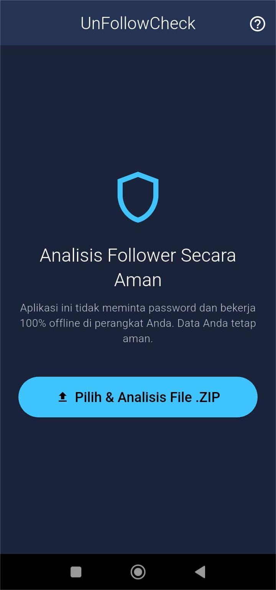

<p align="center">
  
</p>

<h1 align="center">UnFollowCheck</h1>

Aplikasi Flutter yang aman dan 100% offline untuk menganalisis data follower Instagram Anda dan menemukan siapa yang tidak mengikuti Anda kembali (*unfollow back*).

---

## Tampilan Aplikasi

<p align="center">
  
</p>

## ✨ Fitur Utama

-   **Analisis Offline**: Memproses file `.zip` data Instagram langsung di perangkat Anda.
-   **Aman & Privat**: Tidak memerlukan **username** atau **password**. Data Anda tidak pernah keluar dari perangkat Anda.
-   **Deteksi Cepat**: Menemukan dengan cepat akun-akun yang Anda ikuti tetapi tidak mengikuti Anda kembali.
-   **Statistik Lengkap**: Menampilkan ringkasan jumlah *Following*, *Followers*, dan *Tidak Follow Balik*.
-   **Tampilan Hasil Terorganisir**: Hasil ditampilkan dalam beberapa tab yang mudah dinavigasi.
-   **Fungsi Pencarian**: Cari nama pengguna dengan mudah di dalam daftar hasil.
-   **Panduan Lengkap**: Dilengkapi dengan panduan di dalam aplikasi untuk mempermudah pengguna pertama kali.

## 🤔 Mengapa UnFollowCheck?

Banyak aplikasi di luar sana yang menawarkan fitur serupa, namun meminta akses login ke akun Instagram Anda. Ini sangat berisiko dan melanggar Ketentuan Penggunaan Instagram, yang dapat menyebabkan akun Anda diblokir.

UnFollowCheck dibangun dengan tiga prinsip utama:

1.  **Keamanan**: Dengan memanfaatkan fitur resmi "Unduh Data Anda" dari Instagram, aplikasi ini tidak memerlukan kredensial login Anda sama sekali.
2.  **Privasi**: Seluruh proses—mulai dari ekstraksi file `.zip` hingga analisis data—terjadi sepenuhnya di dalam perangkat Anda.
3.  **Kepatuhan**: Aplikasi ini tidak melakukan *scraping* atau tindakan otomatisasi apa pun yang dilarang oleh Instagram.

## ⚙️ Alur Kerja

Penggunaan aplikasi ini sangat sederhana:

1.  **Unduh Data**: Minta unduhan data Anda dari Instagram (hanya kategori "Pengikut dan diikuti") dalam format **JSON**.
2.  **Buka Aplikasi**: Jalankan UnFollowCheck.
3.  **Pilih File**: Tekan tombol "Pilih & Analisis File .ZIP" dan pilih file `.zip` yang Anda dapatkan dari Instagram.
4.  **Lihat Hasil**: Aplikasi akan secara otomatis memproses file dan menampilkan hasilnya dalam hitungan detik.

## 🛠️ Teknologi yang Digunakan

-   **Framework**: Flutter & Dart
-   **State Management**: `provider`
-   **File Handling**: `file_picker` (untuk memilih file) & `archive` (untuk ekstraksi .zip)

## 🚀 Memulai (Untuk Developer)

Jika Anda ingin menjalankan proyek ini di komputer Anda, ikuti langkah-langkah berikut:

1.  **Clone repositori ini:**
    ```bash
    git clone https://github.com/AfandiIkhsyan/FolbekCek.git
    ```
2.  **Masuk ke direktori proyek:**
    ```bash
    cd UnFollowCheck
    ```
3.  **Instal semua dependensi:**
    ```bash
    flutter pub get
    ```
4.  **Jalankan aplikasi:**
    ```bash
    flutter run
    ```
